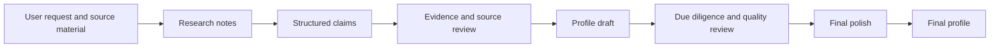

# Architecture

## Current Shape

The project currently consists of:

- source reference documents,
- Markdown working templates,
- project documentation,
- a planned evidence-first multi-agent workflow.

No application architecture has been committed yet.

## Intended Conceptual Architecture

## Components

### Skills

Skills should hold reusable procedures, templates, and review rules. They should be narrow enough to reuse and clear enough for agents to apply consistently.

Candidate Skills:

- Source Quality Checker.
- Individual Prospect Profile Builder.
- Organisation Prospect Profile Builder.
- Due Diligence Screen.
- Event Brief Builder.
- Meeting Brief Builder.
- Philanthropic Alignment Mapper.

### Agents

Agents should apply Skills with a specific role or review lens. Multi-agent workflows should be used when the task is complex enough to justify them.

Suggested roles:

- Research Agent.
- Evidence / Source Agent.
- Profile Writer Agent.
- Due Diligence / Quality Agent.
- Final Polish Agent.
- Documentation Maintainer.

### Orchestrator

The orchestrator will coordinate inputs, intermediate claim review, drafting, quality checks, and final output. The implementation form is not yet decided.

Options to discuss later:

- Codex-native workflow using instructions and Skills.
- A small command-line tool.
- A lightweight local app.
- A hybrid approach.

## Key Architectural Principle

The system should do detailed evidence and confidence work internally, then produce a clean final profile that includes only supported and appropriate material.
